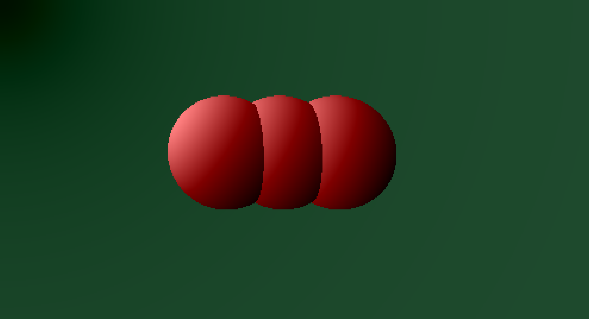

# Sphere Mover

An experiment with C++, SDL2 and OpenMP-based realtime raytracing.

* Move a sphere using either the arrow keys or `w`, `a`, `s`, `d`.
* Switch to the next sphere with `space` or `tab`.
* Toggle fullscreen with `f` or `f11`.
* Quit with `q` or `esc`.
* You can also move the current sphere with a joystick, then press a key to select the next one.

## Screenshot

## Building

Build and run using [`cxx`](https://github.com/xyproto/cxx):

    cxx run

Just build:

    cxx

Or if you wish to generate a `CMakeLists.txt` file in the process and then build with `ninja`:

    cxx cmake ninja

Tested on Arch Linux.

Written in [`o`](https://github.com/xyproto/o).

## General info

* Version: 0.1.0
* Author: Alexander F. Rødseth &lt;xyproto@archlinux.org&gt;
* License: MIT
